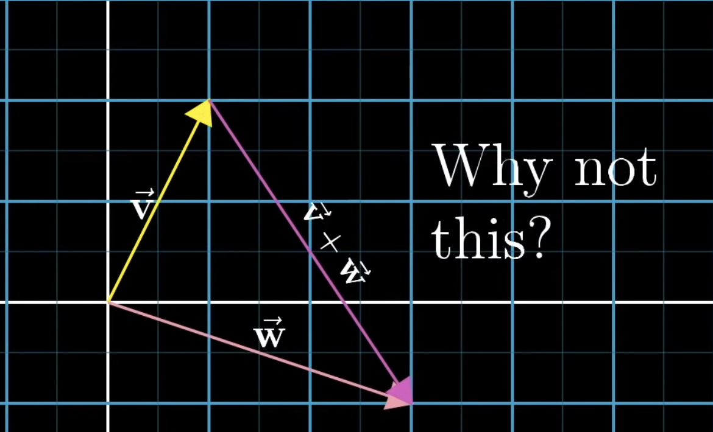

해당 글은 [3Blue1Brown 채널의 Essence of linear algebra](https://www.youtube.com/playlist?list=PLZHQObOWTQDPD3MizzM2xVFitgF8hE_ab)를 정리한 스터디 노트입니다.

# Chapter 1. Essence of linear algebra

벡터는 물리학의 관점에서 공간에서 화살표로 볼 수 있습니다. 벡터는 길이와 방향을 가지는데, 이 두가지가 같다면 공간 어디로 이동시키든 같은 이는 같은 벡터입니다.  

평면에 존재하는 벡터는 2차원 벡터이고, 우리가 살고 있는 공간같이 확장된 공간에 있다면 3차원 벡터입니다.

컴퓨터 과학 관점에서 벡터는 lists of numbers 입니다. 예를 들어 주택가격을 분석하고 싶을 때 고려할 변수로 주택 면적과 가격이 있을 때, 각각의 집을 숫자쌍으로 모델링 할 수 있습니다.  

첫 번째는 면적이고, 두 번째는 가격을 의미합니다. 순서가 중요하기에 둘은 같지 않습니다. 그리고 이는 집을 2차원 벡터로 모델링한 것이 됩니다.

벡터를 기하학 관점에서 하나의 **화살표**로 떠올리면 좋습니다.  
xy 평면과 같은 좌표계 안에 있으며 꼬리는 원점인 화살표를 떠올리면 됩니다. 그리고 벡터를 숫자-리스트라는 관점으로 번역해보면, 이 숫자-리스트는 벡터의 좌표를 의미하게 됩니다.  

3차원의 경우에는 z축이라는 세 번째 축을 추가합니다.  
이 축은 x, y축에 모두 수직입니다. 이렇게 되면 각 벡터는 순차적인 삼중 숫자쌍에 대응됩니다. 첫 번째는 x축을 따라 얼마나 이동할지, 두 번째는 y축에 평행하게 얼마나 이동할지, 세 번째는 z축에 평행하게 얼마나 이동할지를 말해줍니다.  

선형대수의 모든 주제는 **벡터합과 숫자곱**, 이 두가지 연산을 중심으로 일어납니다.

>두 벡터 합 연산의 예

$\begin{bmatrix}3\\-5\\ \end{bmatrix}$ $+$ $\begin{bmatrix}2\\1\\ \end{bmatrix}$ $=$ $\begin{bmatrix}3+2\\-5+1\\ \end{bmatrix}$

> 스칼라 곱 벡터 연산의 예

$2$ $\begin{bmatrix}3\\-5\\ \end{bmatrix}$ $=$ $\begin{bmatrix}2(3)\\2(-5)\\ \end{bmatrix}$

이 연산을 기하학 관점에서 살펴보겠습니다. $v$와 $w$ 두 벡터가 있다고 가정해보겠습니다.  
두 벡터를 더한다는 것은 두번째 벡터의 꼬리를 첫번째 벡터의 끝에 옮기는 것을 말합니다. 그리고나서 첫 번째 꼬리에서 두 번째 끝을 가리키는 새 벡터를 그립니다. 바로 이 새 벡터가 두 벡터의 합입니다.  

그런데 합에 대한 이러한 정의는 선형대수에서 거의 유일하게 벡터를 원점으로부터 멀리 이탈시키는 순간입니다.  
그럼 이렇게 정의하는 것이 타당할까요? 이런 벡터합 정의는 타당하고, 다른 것은 안될까요?  

이 대답에 대한 해결책으로 벡터를 하나의 움직임, 하나의 단계로 봐야합니다.  
즉, 공간에서 특정한 방향과 거리를 가진 움직임을 말합니다. 만약 첫 번째 벡터 따라 이동하고, 다음으로 두 번째 벡터를 따라 이동한다면, 전체적인 효과는 두 벡터의 합을 이동한 것과 같습니다.  

다음으로 스칼라 곱 벡터 연산을 살펴보겠습니다.  
예를 들어 벡터에 숫자 2를 곱하는 것은 벡터를 기존의 2배만큼 늘리는 것을 의미합니다.  

그럼 반대로 벡터에 $1/3$을 곱한다는 것은 원래 길이의 $1/3$으로 줄인다는 것으로 해석할 수 있습니다. 또 음수인 $-1.8$을 곱하는 것은 벡터를 반대방향으로 뒤집고 나서 $1.8$배만큼 늘리는 것으로 해석할 수 있습니다.  

이처럼 벡터 길이를 늘이거나 줄이거나, 방향을 뒤집는 것을 **스케일링(scaling)** 이라고 부릅니다.

## Summary
이번 시간에는 벡터의 기초에 대해 살펴보았습니다.  
평소 벡터를 연산하는 과정을 새롭게 기하학 측면에서 어떻게 이루어지는지 다시 한 번 살펴보았습니다. 

다음 장에서는 스팬(span), 기저(basis), 선형독립(linear independent)의 개념에 대해 살펴보겠습니다.

## Reference
1. https://www.youtube.com/playlist?list=PLZHQObOWTQDPD3MizzM2xVFitgF8hE_ab
